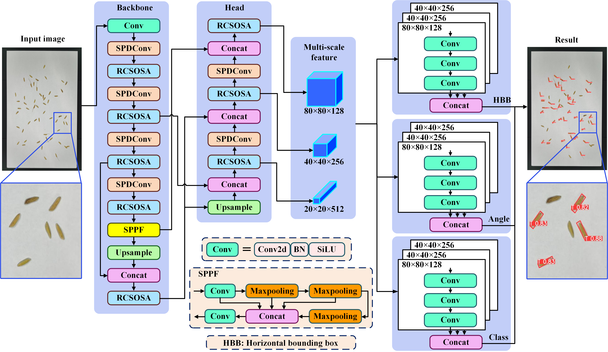

# YOLOrot2.0: A Novel Algorithm for High-precision Rice Seed Measurement with Real-time Processing



## YOLOrot2.0
YOLOrot2.0 consists of an oriented object detection algorithm based on YOLOv8, tuned for small objects detection like rice seed,
and a real-size measurement algorithm to measure to convert from pixel length and height to real world measurement units.
The oriented object detection algorithm is a combination of SPDConv, RCS-OSA and KFIoU loss for better performance in small object detection and oriented object detection.
A online application is provided [here](http://www.xhhuanglab.cn/tool/SeedRuler.html).


## experiment result
Experiments were conducted on the [this dataset](https://www.kaggle.com/datasets/cccccabbage/rice370), which consists of 371 rice seed images of total 40,000 seeds.
The images contain the targets, plump rice seeds, and distruction like shriveled seeds and stems. Each image contains 50-150 seeds on average.
About 80% of seed images are labeled manually for trainning and evaluating.

|| Precision | Recall | mAP@0.5 | detection time per image (ms) |
|---:|---:|---:|---:|---:|
| R3Det | 0.825 | **0.977** | 0.867 | 1612.2 |
| R-CenterNet | 0.722 | 0.712 | 0.679 | 80.5 |
| YOLOv8 | 0.869 | 0.960 | 0.939 | **8.4** |
| YOLOrot | 0.847 | 0.957 | 0.920 | 403.2 |
| YOLOrot2.0 | **0.887** | 0.958 | **0.951** | 11.5 |

## Environment and usage

### requirements
The requirements are almost the same as the [ultralytics](https://github.com/ultralytics/ultralytics), and a requirements.txt is also provided if needed.
```
pip install ultralytics
# or pip install -r requirements.txt
```

### dataset
The dataset can be found [here](https://www.kaggle.com/datasets/cccccabbage/rice370).

The dataset directory should be formatted as follow:
```
YOLOrot2.0
|   dataset
|   |   images
|   |   |   train
|   |   |   |   1.jpg
|   |   |   |   ......
|   |   |   test
|   |   |   val
|   |   labels
|   |   |   train
|   |   |   |   1.txt
|   |   |   |   ......
|   |   |   test
|   |   |   val
|   |   rice370.yaml
```

### train
```
cd YOLOrot2.0
python train.py
```

### test
```
cd YOLOrot2.0
# remember to edit the weight path in test.py
python test.py
```
